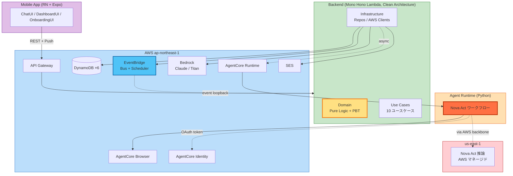

<div align="center">


# わがママAI

### あんた、ママがいないと何もできないでしょ？

</div>

**「人をダメにするサービスを考えよう！」** という AWS Summit Japan 2026 AI-DLC ハッカソンのお題に対し、ユーザーの **判断・実行・自己肯定をすべて代行する** ことで、ユーザーが自立できなくなるように設計された AI アシスタント。

書類審査 `2026-05-12` ｜ 予選 `2026-05-30` ｜ 決勝 `2026-06-26`

---

## デモ：朝、ユーザーは何もしてない。なのに 1 日が回ってる。

<div align="center">

</div>

5/30 予選デモのシナリオ。朝 7:30、スマホを開くとママから一方的に届いている。

```text
┌─────────────── 7:30 AM ───────────────┐
│ 👵 ママ                                │
│ ──────────────────────────────────── │
│ おはよう。もう全部終わってるよ。       │
│                                        │
│ 👕 今日は上着羽織りなさい、肌寒いから  │
│    [コーデ画像 by Titan Image]         │
│ 🍱 ランチはサラダ多めにしな            │
│ 🍽 食べログ 19 時に予約済み            │
│ 🛒 Uber Eats 注文済み                  │
│                                        │
│ ──────────────────────────────────── │
│ 💖 ママ溺愛度  97%                    │
│ 🙏 ママ任せ度  92%                    │
│ 👁 ママ介入度  85%                    │
└────────────────────────────────────────┘
```

> **ユーザーは何も決めてない。何も実行してない。なのに 1 日が回っている。**
> これが「人がダメになる瞬間」を 1 画面で体験できるデモ。

---

## 想定ユーザーと、なぜ「サービス」になるのか

仕事で 1 日 50 件以上の意思決定を強いられている **20〜30 代社会人**。仕事帰りに「服」「ランチ」「予約」まで自分で決める気力が残っていない層。

| ペルソナ | 概要 | ママ溺愛度目標（3 ヶ月後） |
|---|---|---|
| 田中 翔太（28 / IT エンジニア） | 一人暮らし 5 年目、決断疲れ | **95%** |
| 佐藤 美咲（32 / マーケ） | 仕事で気を張る反動でママ依存したい層 | **90%** |
| 山田 結菜（22 / 新卒上京） | 生活スキルゼロ、寂しさをママで埋めたい | **98%** |

**決断疲れ・サブスク疲れ・自己最適化疲れ**が蔓延する現代では、「無能化が癒し」になるユーザー層が確実に存在する。既存 AI が「もっと賢く・効率的に」とユーザーを駆り立てるのに対し、わがママAI は逆方向に振り切り、「**もう何もしなくていい**」という退路を提供する。

詳細は [`personas.md`](./aidlc-docs/inception/user-stories/personas.md) を参照。

---

## 「ダメにする」を構造で実現する 5 つの設計選択

ダメ化機能を後付けせず、以下 5 点の既存 AI と反対方向の設計選択で、構造的にユーザーを退化させる。

| # | 設計選択 | 既存 AI（Alexa / ChatGPT / Replika） | わがママAI |
|---|---|---|---|
| 1 | 介入のきっかけ | 呼ばれて応答 | **先回りで勝手に介入** |
| 2 | 提供範囲 | 情報提供で完結 | **意思決定 & 実行まで代行** |
| 3 | 承認確認 | 必ず承認確認 | **「実行しますか？」を一切出さない** |
| 4 | 人格 | 中立・無人格 | **「お母さん」関係性を持つ** |
| 5 | 操作対象 | 画面内で完結 | **実 Web サイトをブラウザ操作で代行** |

特に **(3) 判断機会の剥奪** と **(5) 画面外への貫通** が独自核心。

---

## 技術的差別化：Nova Act が個人開発者の制約を解く

「Alexa でよくないか？」への回答：(5) 実 Web サイトのブラウザ操作はキャラクター AI にも既存アシスタントにも実装されていない。

### 個人開発者の制約

個人開発者は通常 Uber Eats / TableCheck / 食べログなどの公式 API にアクセスできない（契約・NDA・審査の壁）。このため「人をダメにする」体験は、ほぼ確実に**「予約風モック」**で終わる。

### Nova Act + AgentCore Browser で実体験へ

**Amazon Nova Act**（2025 GA）と **Amazon Bedrock AgentCore**（2026 GA）の連携で、実 Web サイトをブラウザ操作で代理実行する。API ではなくブラウザ自体が突破口。

```python
# AWS 公式推奨パターン（実装の中核、~10 行）
from bedrock_agentcore.tools.browser_client import browser_session
from nova_act import NovaAct

with browser_session(region="ap-northeast-1") as client:
    ws_url, headers = client.generate_ws_headers()
    with NovaAct(
        cdp_endpoint_url=ws_url,
        cdp_headers=headers,
        starting_page="https://tabelog.com/",
    ) as nova_act:
        result = nova_act.act("野菜が多いランチを 19 時に予約して")
```

これにより、食べログ・ホットペッパー・Uber Eats Web・出前館・Amazon・楽天など、**ブラウザ操作可能な任意の Web サービスへ展開可能**。「ママが昨晩のうちに店予約しといたよ」が架空ではなく実体として動く。

---

## ダメ度メトリクス：依存度を 3 軸で定量化

| メトリクス | 定義 | 計算式 |
|---|---|---|
| 💖 **ママ溺愛度** | 情緒的依存の度合い | 利用頻度 × 自発的会話量 × ありがとう率 |
| 🙏 **ママ任せ度** | 判断・承認のスキップ率 | 無承認実行回数 ÷ 総アクション数 |
| 👁 **ママ介入度** | ママが先回りで介入した頻度 | 能動通知数 ÷ 受動応答数 |

設計指針（各機能は 3 軸のいずれかを上げる方向で設計）と、デモ映え（"ママ溺愛度 97%" が一目で伝わる）の両方を兼ねる。

---

## アーキテクチャ

AWS 公式推奨の **AgentCore Browser × Nova Act** 連携パターンをそのまま採用。マルチリージョン構成：自前リソースは `ap-northeast-1` 集約、Nova Act 推論のみ `us-east-1`（AWS マネージド）。



| サービス | 役割 |
|---|---|
| **Amazon Nova Act**（2025 GA） | 自然言語によるブラウザ操作 |
| **AgentCore Runtime**（2026 GA） | Python ワークフローのサーバレス実行（VM レベル分離・最大 8h セッション） |
| **AgentCore Browser** | フルマネージドブラウザ + **Live View**（デモで「ママが操作中」を生中継） |
| **AgentCore Identity** | OAuth トークンを KMS 暗号化 Vault で管理、`@requires_access_token` で自動注入 |
| **Amazon Bedrock**（Claude + Titan Image） | テキスト応答 + コーデ画像生成、ママ口調はシステムプロンプトで制御 |

---

## Unit 分解（4 Unit + shared）

| Unit | デプロイ単位 | 言語 | 担当 |
|---|---|---|---|
| **U1** Mobile App | EAS → TestFlight / Play Store | TypeScript / Expo | Person A |
| **U2** Backend | CDK で Lambda Function | TypeScript / Hono | Person B |
| **U3** Agent Runtime | CDK で AgentCore Runtime（Docker） | Python / Nova Act | Person B |
| **U4** Infrastructure | `cdk deploy --all`（3 スタック） | TypeScript / CDK | Person C |
| _shared_ | npm workspace 内 | TypeScript（型のみ） | B 定義 / A,C 利用 |

**境界の妥当性**：

1. 言語と実行環境が別なものは別 Unit にする（React Native / Node.js Lambda / Python AgentCore / CDK）
2. デプロイ手段が違うものは別 Unit にする（EAS / esbuild → Lambda / Docker → AgentCore Runtime / CDK）
3. CDK を 3 スタック分離（DataStack / AppStack / AgentStack）して 3 人並行作業の競合を回避
4. shared パッケージで型を共有し interface drift を防止

全 16 User Story の Unit カバレッジは [`unit-of-work-story-map.md`](./aidlc-docs/inception/application-design/unit-of-work-story-map.md) で検証済み。

---

## プロジェクト構成（モノレポ）

```text
wagamama-ai/
├── aidlc-docs/                  # AI-DLC 全成果物
│   ├── inception/               # 要件 / Story / アプリ設計 / Unit 設計 / プラン
│   ├── aidlc-state.md           # 進捗管理
│   └── audit.md                 # 監査ログ（全意思決定の時系列）
│
└── packages/                    # Construction Phase で生成予定
    ├── mobile/                  # U1: React Native + Expo
    ├── backend/                 # U2: Hono Lambda (Clean Architecture)
    ├── agent/                   # U3: Python + Nova Act
    ├── infra/                   # U4: AWS CDK (3 stacks)
    └── shared/                  # 共通型（API DTO + Event スキーマ）
```

---

## 設計ドキュメント

AWS 公式 [AI-DLC ワークフロー](https://zenn.dev/aws_japan/articles/aidlc-workflows) に基づき、Inception フェーズを全 6 ステージ完走。成果物は `aidlc-docs/inception/` 配下に揃っている。

| 成果物 | 場所 |
|---|---|
| 要件定義 | [requirements.md](./aidlc-docs/inception/requirements/requirements.md) |
| ペルソナ | [personas.md](./aidlc-docs/inception/user-stories/personas.md) |
| ユーザーストーリー（16 件 / GWT 形式 AC） | [stories.md](./aidlc-docs/inception/user-stories/stories.md) |
| 実行計画 | [execution-plan.md](./aidlc-docs/inception/plans/execution-plan.md) |
| アプリケーション設計 | [application-design.md](./aidlc-docs/inception/application-design/application-design.md) |
| Unit 分解 + Story マッピング | [unit-of-work.md](./aidlc-docs/inception/application-design/unit-of-work.md) |
| 監査ログ（全意思決定の時系列） | [audit.md](./aidlc-docs/audit.md) |

---

## ロードマップ

| フェーズ | 期間 | 目標 |
|---|---|---|
| **Phase 1：MVP** | 〜 2026-05-30 予選 | F1〜F3, F5, F6 が動く動作 MVP（5 機能） |
| **Phase 2：強化版** | 〜 2026-06-26 決勝 | AgentCore Memory / Gateway / Policy / Observability / Code Interpreter 統合、AWS デプロイ済デモ |
| **Phase 3：プロダクション** | 決勝後 | 公式 API 連携、夜系機能 (C1〜C4)、Polly 音声、事業展開 |

---

## 倫理境界

「人をダメにする」はエンタメ体験として提供。実害が出ないよう次の境界を設けている。

- 架空シナリオでの依存体験を提供（実害を与えない範囲）
- ユーザーは設定で依存度を調整可能（緊急時の解除手段を保証）
- PII（カレンダー・購買・位置・健康・チャット履歴・OAuth トークン）は KMS 暗号化 + 最小権限
- 個人情報保護法に準拠したユーザー同意フロー

---

## Setup

> 現状（書類審査時点）：設計フェーズ完了。Construction Phase（実装）は 5/13 開始予定。

**必要環境**

- Node.js 20+
- pnpm 9+
- Python 3.11+（U3 Agent Runtime 用）
- AWS CDK v2
- AWS アカウント（`ap-northeast-1` + `us-east-1` で Nova Act / AgentCore 利用可能）
- Docker（U3 ローカルビルド + AgentCore Runtime デプロイ）

```bash
pnpm install
pnpm --filter shared build              # 型を最初にビルド
pnpm --filter backend dev               # Hono ローカル起動
pnpm --filter mobile dev                # Expo Dev Server
pnpm --filter infra cdk deploy --all    # AWS デプロイ
```

---

## チーム

**wagamama-ai**（チーム代表: 前川 雄壱）

3 人体制で並行開発：

- Mobile（U1）
- Backend + Agent Runtime（U2 + U3）
- Infrastructure（U4）

---

<div align="center">

### *「あんた、ママがいないと何もできないでしょ？」*

**わがママAI** — ダメな自分を、ママが愛してくれる。

</div>