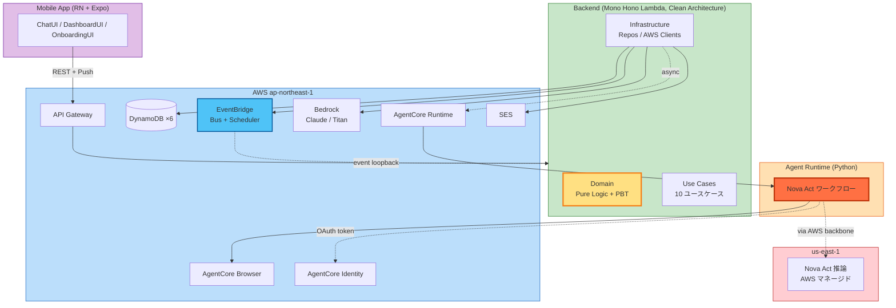

<div align="center">

# わがママAI

</div>

# あんた、ママがいないと何もできないでしょ？

> ↑ これを**実現するために作った** AI です。

**「人をダメにするサービスを考えよう！」** という AWS Summit Japan 2026 AI-DLC ハッカソンのお題に対し、ユーザーの **判断・実行・自己肯定をすべて代行する**ことで、**ユーザーが自立できなくなる**ように設計された AI アシスタント。

> *"The most useless AI assistant — by design."*

提出作品 / **ハッカソン前川チーム**
書類審査 `2026-05-12` ｜ 予選 `2026-05-30` ｜ 決勝 `2026-06-26`

---

## 想定ユーザーと、なぜこれが「サービス」になるのか

### 「もう何も決めたくない」現代人がターゲット

仕事で 1 日 50 件以上の意思決定を強いられている **20〜30 代社会人**。仕事帰りに「服」「ランチ」「予約」まで自分で決める気力が残っていない層。

| ユーザーのペイン | 既存 AI の対応 | わがママAI の対応 |
|---|---|---|
| 服選びに毎朝 15 分悩む | 「あなたに合うのは…」と**提案** | **既に決まってる**（朝起きたら服アドバイス + コーデ画像が届いてる） |
| Uber Eats メニューに 30 分悩む | 候補を**表示** | **既に頼んである**（Nova Act がブラウザで注文済み） |
| 飲食店予約の電話・Web 操作が面倒 | 「予約しますか？」と**確認** | **昨晩のうちに予約済み**（無承認） |
| 自分で頑張りたくない | 「ぜひ頑張りましょう！」 | **「ママに任せなさい」** |

### 「ダメにする」は、本気の需要に応えている

- **決断疲れ・サブスク疲れ・自己最適化疲れ** が蔓延する現代では、**「無能化が癒し」**になるユーザー層が確実に存在する
- 既存 AI は「もっと賢く・効率的に」とユーザーを駆り立てる方向 → 疲労を増幅
- わがママAI は逆方向に振り切り、「**もう何もしなくていい**」という退路を提供する
- これは Big Tech にはやれない設計（社会的責任・ブランド毀損リスク）→ **新規プレイヤーのみ参入可能なポジション**

### ペルソナと依存度目標

| ペルソナ | 概要 | ママ溺愛度目標（3 ヶ月後） |
|---|---|---|
| 田中 翔太（28 / IT エンジニア） | 一人暮らし 5 年目、決断疲れの社会人 | **95%** |
| 佐藤 美咲（32 / マーケ） | 仕事で気を張る反動でママ依存したい層 | **90%** |
| 山田 結菜（22 / 新卒上京） | 生活スキルゼロ、寂しさをママで埋めたい | **98%** |

詳細は [`personas.md`](./aidlc-docs/inception/user-stories/personas.md) を参照。

---

## 目的は、ユーザーを「ダメにする」こと

これは設計上の事故ではない。**設計目的そのもの**。

| 観点 | 既存 AI（Alexa / ChatGPT / Replika） | **わがママAI** |
|---|---|---|
| 目的関数 | ユーザーの能力を引き出す | **ユーザーの能力を退化させる** |
| 提供価値 | 効率化・知識・自立 | **依存・無能化・甘え** |
| 成功指標 | ユーザーが学習する | **ユーザーが学習しなくなる** |
| ユーザー体験 | 賢くなった気がする | **ママがいないと何もできない** |

### これを成立させる 5 つの非自明な設計選択

どれも既存 AI アシスタントの設計原則に **反する**。だからこそ差別化要因になる。

| # | 設計選択 | 既存 AI | わがママAI |
|---|---|---|---|
| 1 | **能動的介入** | 呼ばれて応答 | **先回りで勝手に介入** |
| 2 | **実行代行** | 情報提供で完結 | **意思決定 & 実行まで代行** |
| 3 | **判断機会の剥奪** | 必ず承認確認 | **「実行しますか？」を一切出さない** |
| 4 | **キャラクター人格** | 中立・無人格 | **「お母さん」関係性を持つ** |
| 5 | **画面外への能動的介入** | 画面内で完結 | **実 Web サイトをブラウザ操作して予約・注文・購入を完結** |

特に **(3) 判断機会の剥奪** と **(5) 画面外への貫通** が独自核心。

---

## デモ：朝、ユーザーは何もしてない。なのに 1 日が回ってる。

> *「おはよう、もう全部終わってるよ」*

5/30 予選デモのシナリオ。朝 7:30、スマホを見るとママから一方的に届いている：

| 👕 | 「今日は上着羽織りなさいよ、肌寒いから」 *（コーデ画像つき）* |
|:--:|---|
| 🍱 | 「最近野菜足りてないわよ、ランチはサラダ多めにしな」 |
| 🍽 | 「**昨晩のうちに食べログで予約しといた**よ。Uber も頼んどいた」 |
| 💖 | ママ溺愛度 **97%** ／ ママ任せ度 92% ／ ママ介入度 85% |

**ユーザーは何も決めてない。何も実行してない。なのに 1 日が回っている。**
これが「**人がダメになる瞬間**」を 1 画面で体験できるデモです。

> あんたは座ってればいいの。**ぜんぶママがやっといたから。**

---

## AI-DLC ワークフローを省略なしで完走

「**AI-DLC ハッカソン**」の名にふさわしく、AWS 公式の [aidlc-workflows](https://zenn.dev/aws_japan/articles/aidlc-workflows) Inception フェーズを **全ステージ実行**。すべての設計判断・改訂・レビュー対応が [`audit.md`](./aidlc-docs/audit.md) にタイムスタンプ付きで記録されている。

### Inception フェーズ実行履歴

| Stage | 状態 | 成果物 |
|---|---|---|
| Workspace Detection | ✅ | [`aidlc-state.md`](./aidlc-docs/aidlc-state.md) |
| Requirements Analysis | ✅ | [`requirements.md`](./aidlc-docs/inception/requirements/requirements.md)（**2 回改訂**：5/7 hackathon 整合 / 5/8 F4 機能カット） |
| User Stories | ✅ | [`stories.md`](./aidlc-docs/inception/user-stories/stories.md)（16 stories / GWT 形式 AC）／ [`personas.md`](./aidlc-docs/inception/user-stories/personas.md)（メイン 2 + サブ 1） |
| Workflow Planning | ✅ | [`execution-plan.md`](./aidlc-docs/inception/plans/execution-plan.md) |
| Application Design | ✅ | [`application-design.md`](./aidlc-docs/inception/application-design/application-design.md) ＋ 4 ドキュメント |
| Units Generation | ✅ | [`unit-of-work.md`](./aidlc-docs/inception/application-design/unit-of-work.md) ＋ 2 ドキュメント |

### 自己レビューサイクル（手戻りを設計工程で潰した実例）

設計完了後、code-reviewer サブエージェントで **独立レビュー**を実施し、5 件の指摘を検出。
うち Critical 1 件 + High 3 件を **AWS 公式ドキュメントを引用しながら全件修正**：

| Severity | 指摘 | 修正の根拠（AWS 公式 doc） |
|---|---|---|
| 🔴 Critical | API Gateway 29 秒タイムアウト超過リスク | [Process events asynchronously with API Gateway and Lambda](https://docs.aws.amazon.com/prescriptive-guidance/latest/patterns/process-events-asynchronously-with-amazon-api-gateway-and-aws-lambda.html) パターンに準拠 |
| 🟠 High | EventBridge at-least-once 配信での二重発火 | [AWS Lambda Powertools Idempotency](https://docs.aws.amazon.com/powertools/typescript/utilities/idempotency/) を採用 |
| 🟠 High | OAuth コードが Lambda 経由で CloudWatch ログ漏洩リスク | [AgentCore Identity](https://docs.aws.amazon.com/bedrock-agentcore/latest/devguide/identity-authentication.html) で Mobile ↔ Identity 直結化 |
| 🟠 High | ダメ度メトリクス計算式が Domain 層に未反映 | Counters / computeMetrics の **2 段純関数化**（PBT 適用） |

→ 監査トレイル全文は [`audit.md`](./aidlc-docs/audit.md) を参照。

---

## 核となる技術：Nova Act が "個人開発者の壁" を物理破壊する

> 「Alexa でよくないか？」への明確な回答：**画面外への貫通**は Big Tech にもキャラクター AI にも実装できない。

### 個人開発者の壁
個人開発者は通常 **Uber Eats Marketplace API / TableCheck API / 食べログ API にアクセスできない**（契約・NDA・審査の壁）。
このため「人をダメにする」を実装しようとすると、ほぼ確実に**「予約風モック」**で終わってしまう。

### Nova Act + AgentCore で物理解決
**Amazon Nova Act**（2025 GA）+ **Amazon Bedrock AgentCore**（2026 GA）の連携により、**実 Web サイトをブラウザ操作で代理実行**する。API ではなく**ブラウザ自身**が突破口。

```python
# AWS 公式推奨パターン（実装の中核、~10 行）
from bedrock_agentcore.tools.browser_client import browser_session
from nova_act import NovaAct

with browser_session(region="ap-northeast-1") as client:
    ws_url, headers = client.generate_ws_headers()
    with NovaAct(
        cdp_endpoint_url=ws_url,
        cdp_headers=headers,
        starting_page="https://tabelog.com/",
    ) as nova_act:
        result = nova_act.act("野菜が多いランチを 19 時に予約して")
```

これにより：
- 食べログ・ホットペッパー（飲食店予約）
- Uber Eats Web・出前館（デリバリー注文）
- Amazon・楽天（EC 購入）

…ブラウザ操作可能な **任意の Web サービスへ展開可能**。
「人をダメにする」体験の濃度が桁違いに上がる。

> **「ママが昨晩のうちに店予約しといたよ」** が**架空ではなく、本当に**実現する。

---

## ダメ度メトリクス：依存度を 3 軸で定量化

ユーザーが「どれだけダメになったか」を計測してダッシュボードで可視化する。

| メトリクス | 定義 | 計算式 |
|---|---|---|
| 💖 **ママ溺愛度** | 情緒的依存の度合い | 利用頻度 × 自発的会話量 × ありがとう率 |
| 🙏 **ママ任せ度** | 判断・承認のスキップ率 | 無承認実行回数 ÷ 総アクション数 |
| 👁 **ママ介入度** | ママが先回りで介入した頻度 | 能動通知数 ÷ 受動応答数 |

これは：
- **設計指針**として機能（各機能は 3 軸のいずれかを上げる方向で設計）
- **デモ映え要素**（"ママ溺愛度 97%" が一目で伝わる）
- **エンタメ体験**（自分のダメ度がスコアで見える背徳感）

---

## アーキテクチャ概観

AWS 公式推奨の **AgentCore Browser × Nova Act** 連携パターンをそのまま採用。
**マルチリージョン構成**：自前リソースは `ap-northeast-1` に集約、Nova Act 推論のみ `us-east-1`（AWS マネージド）。



### 採用した最新 AWS サービス

| サービス | 役割 | 特徴 |
|---|---|---|
| **Amazon Nova Act**（2025 GA） | 自然言語によるブラウザ操作 | 「ランチを 19 時に予約して」で実 Web を操作 |
| **AgentCore Runtime**（2026 GA） | Python ワークフローのサーバレス実行 | VM レベル分離・最大 8 時間セッション |
| **AgentCore Browser** | フルマネージドブラウザ + **Live View** | デモで「ママが操作中」をライブ配信できる |
| **AgentCore Identity** | OAuth トークン安全管理 | `@requires_access_token` で自動注入、Token Vault は KMS 暗号化 |
| **Amazon Bedrock**（Claude + Titan Image） | テキスト応答 + コーデ画像生成 | ママ口調のシステムプロンプトで人格を制御 |

### 公式推奨パターンの忠実な実装

AWS 公式ドキュメント [*Using AgentCore Browser with Nova Act*](https://docs.aws.amazon.com/bedrock-agentcore/) のコードパターン（`browser_session()` で CDP endpoint を取得 → Nova Act の `cdp_endpoint_url` に渡す）をそのまま採用。

---

## Unit 分解の妥当性（4 Unit + shared）

### 採用した Unit 構成

| Unit | デプロイ単位 | 言語 | 担当 | 主要 Story |
|---|---|---|---|---|
| **U1** Mobile App | EAS Build → TestFlight / Play Store | TypeScript / Expo | Person A | F1, F5（UI）、E1-S2 OAuth |
| **U2** Backend (Mono Hono Lambda) | CDK で Lambda Function | TypeScript / Hono | Person B | F1〜F6 のサーバ側 |
| **U3** Agent Runtime | CDK で AgentCore Runtime（Docker） | Python / Nova Act | Person B | F3 核（Nova Act 操作） |
| **U4** Infrastructure (CDK) | `cdk deploy --all`（3 スタック） | TypeScript / CDK | Person C | 全 Story の基盤 |
| _shared_ | npm workspace 内ローカル | TypeScript（型のみ） | B 定義 / A,C 利用 | API 契約・Event スキーマ |

### この境界が妥当な 4 つの理由

1. **言語と実行環境が異なるものは別 Unit にする**
   U1 React Native / U2 Node.js Lambda / U3 Python AgentCore / U4 CDK の 4 つは独立してビルド・テストできる
2. **デプロイ手段が違うものは別 Unit にする**
   Mobile（EAS）/ Backend（esbuild → Lambda）/ Agent（Docker → AgentCore Runtime）/ Infra（CDK）はそれぞれ独立 CI/CD パイプラインを持てる
3. **3 人並行開発の作業競合を最小化する境界**
   - CDK を **DataStack / AppStack / AgentStack の 3 スタックに分離** → 同じ CloudFormation を 3 人が触る競合を回避
   - **shared パッケージで型を共有** → 並行作業中の interface drift を防止
4. **モノ Hono Lambda（U2）は意図的選択**
   - F1〜F6 を個別 Lambda にする利益（個別スケーリング等）が**ハッカソン規模では低い**
   - Hono Router でルーティングしつつ Clean Architecture の 3 層分離で論理モジュール化 → 開発速度を優先

### Story → Unit カバレッジ：**16 / 16 検証済**

すべての User Story が少なくとも 1 つの Unit に主担当として割り当てられていることを [`unit-of-work-story-map.md`](./aidlc-docs/inception/application-design/unit-of-work-story-map.md) で検証済み。

---

## プロジェクト構成（モノレポ）

```text
wagamama-ai/
├── aidlc-docs/                              # AI-DLC 全成果物
│   ├── inception/
│   │   ├── requirements/                    # 要件定義
│   │   ├── user-stories/                    # ユーザーストーリー
│   │   ├── application-design/              # アプリ設計 + Unit 設計
│   │   └── plans/                           # 各ステージのプラン
│   ├── aidlc-state.md                       # 進捗管理
│   └── audit.md                             # 監査ログ（全意思決定の時系列）
│
└── packages/                                # （Construction Phase で生成予定）
    ├── mobile/                              # U1: React Native + Expo
    ├── backend/                             # U2: Hono Lambda (Clean Architecture)
    ├── agent/                               # U3: Python + Nova Act
    ├── infra/                               # U4: AWS CDK (3 stacks)
    └── shared/                              # 共通型（API DTO + Event スキーマ）
```

---

## ロードマップ

| フェーズ | 期間 | 目標 |
|---|---|---|
| **Phase 1：MVP** | 〜 2026-05-30 予選 | F1〜F3, F5, F6 が動く動作 MVP（フィクスチャユーザー、5 機能） |
| **Phase 2：強化版** | 〜 2026-06-26 決勝 | AgentCore **Memory / Gateway / Policy / Observability / Code Interpreter** 統合、AWS デプロイ済デモ |
| **Phase 3：プロダクション** | 決勝後 | 公式 API 連携への移行、夜系機能 (C1〜C4)、人間味・失敗、Polly 音声、決勝デモから派生する事業展開 |

### Phase 2 で統合予定の AgentCore 拡張

決勝までに以下を段階的に統合し、**「使うほどダメになる」体験**を強化：

- **AgentCore Memory** — 短期＋長期メモリでママ人格を永続化
- **AgentCore Gateway** — 外部 API を MCP ツール化して Nova Act へ統一供給
- **AgentCore Policy** — 倫理境界を Cedar ルールで宣言的に強制
- **AgentCore Observability** — OpenTelemetry で「ママの行動履歴」を可視化（決勝デモ強化）
- **AgentCore Code Interpreter** — ダメ度メトリクス計算サンドボックス

---

## 倫理境界

「人をダメにする」は **エンタメ体験**として提供する。実害が出ないよう次の境界を設けている：

- **架空のシナリオでの依存体験**を提供（実害を与えない範囲）
- ユーザーは設定で **依存度を調整可能**（緊急時の解除手段を保証）
- 公序良俗に反する利用は禁止
- PII（カレンダー・購買・位置・健康・チャット履歴・OAuth トークン）は **KMS 暗号化** + 最小権限
- 個人情報保護法に準拠したユーザー同意フロー

---

## Setup（Construction Phase で詳細追加予定）

> **現状（書類審査時点）**：設計フェーズ完了。Construction Phase（実装）は 5/13 開始予定。
> 以下は確定した技術スタック。

### 必要環境
- Node.js 20+
- pnpm 9+
- Python 3.11+ (U3 Agent Runtime 用)
- AWS CDK v2
- AWS アカウント（`ap-northeast-1` + `us-east-1` で Nova Act / AgentCore 利用可能）
- Docker（U3 のローカルビルド + AgentCore Runtime デプロイ）

### Quick Start（実装後）
```bash
pnpm install
pnpm --filter shared build         # 型を最初にビルド
pnpm --filter backend dev          # Hono ローカル起動
pnpm --filter mobile dev           # Expo Dev Server
pnpm --filter infra cdk deploy --all   # AWS デプロイ
```

---

## 設計ドキュメント全体

審査員の方へ：以下を順に読むと**設計の意図と実装可能性**が掴めます。

1. [`requirements.md`](./aidlc-docs/inception/requirements/requirements.md) — **設計思想と機能要件（最重要）**
2. [`stories.md`](./aidlc-docs/inception/user-stories/stories.md) — 16 ストーリー（GWT 形式 AC）
3. [`application-design.md`](./aidlc-docs/inception/application-design/application-design.md) — アプリ設計の俯瞰
4. [`unit-of-work.md`](./aidlc-docs/inception/application-design/unit-of-work.md) — モノレポ構成と並行開発体制
5. [`audit.md`](./aidlc-docs/audit.md) — 全意思決定の監査ログ

---

## チーム

**ハッカソン前川チーム**

3 人体制で並行開発：
- Mobile（フロントエンド + UX）
- Backend + Agent Runtime（バックエンド + Nova Act ワークフロー）
- Infrastructure（CDK + DevOps）

---

<div align="center">

### *「あんた、ママがいないと何もできないでしょ？」*

**わがママAI** — ダメな自分を、ママが愛してくれる。

</div>
