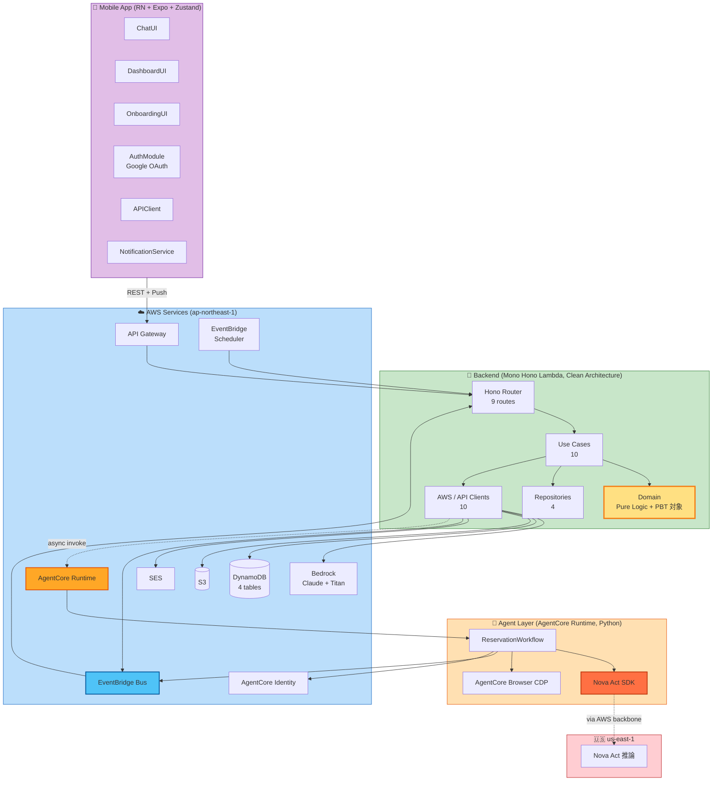

# Application Design — わがママAI（統合版）

**作成日**: 2026-05-08
**目的**: components.md / component-methods.md / services.md / component-dependency.md を統合した俯瞰版。
**前提**: requirements.md / stories.md / personas.md / application-design-plan.md（全 8 質問回答済）

> 各セクションの詳細は分割ドキュメントを参照。本ドキュメントは Application Design ステージの**ハブ**として機能する。

---

## 1. 採用した設計判断（application-design-plan.md より）

| 質問 | 採用 | 影響 |
|---|---|---|
| Q1: Lambda 粒度 | **A** モノ Hono Lambda | 全機能を単一 Lambda、ルーティングは Hono Router |
| Q2: チャット通信 | **D** REST + Push | WebSocket / SSE 不要、能動通知は APNs/FCM |
| Q3: AgentCore 起動 | **B** 非同期 + EventBridge | 202 Accepted で即返却、完了は EventBridge ループバック |
| Q4: メトリクス更新 | **B** EventBridge 経由 | 同期処理から分離、純関数 `calculateMetricsDelta` で計算 |
| Q5: 認証 | **D** Google OAuth | Calendar OAuth と同一クライアント再利用、AgentCore Identity 集中管理 |
| Q6: DynamoDB | **B** 薄い Repository | 4 リポジトリ、PBT 親和性 |
| Q7: フロント State | **A** Zustand | 軽量、Chat Store / Metrics Store |
| Q8: バックエンド構造 | **B** Clean Architecture | domain / application / infrastructure 3 層分離 |

---

## 2. アーキテクチャ全景

---

## 3. レイヤー別概要

### 3.1 Frontend（Mobile App）
- **技術**: React Native + Expo, Zustand (Q7=A)
- **コンポーネント**: ChatUI / DashboardUI / OnboardingUI / AuthModule / APIClient / NotificationService / Stores
- **対応 Story**: F1, F5, F6（クライアント側）+ オンボーディング

### 3.2 Backend（Mono Hono Lambda, Clean Architecture）
- **技術**: TypeScript, Hono, AWS SDK
- **構造（Q8=B）**:
  - **Domain**: 8 純関数・Entity・VO（**PBT 主対象**）
  - **Application**: 10 Use Case
  - **Infrastructure**: 4 Repositories（Q6=B） + 10 Clients + 9 Hono Routes
- **配置**: ap-northeast-1, モノ Lambda（Q1=A）

### 3.3 Agent Layer（AgentCore Runtime）
- **技術**: Python, Nova Act SDK, AgentCore Browser, AgentCore Identity
- **責務**: F3 の核（Nova Act でブラウザ操作 + Calendar 登録 + 完了通知）
- **配置**: ap-northeast-1（Nova Act 推論のみ us-east-1 にバックエンド）
- **起動方式（Q3=B）**: Hono Lambda から非同期起動 → 完了は EventBridge で Hono Lambda へループバック

### 3.4 AWS インフラ
- DynamoDB / S3 / Bedrock / SES / EventBridge / KMS / Cognito（オプション）
- マルチリージョン構成: 自前管理は ap-northeast-1、Nova Act 推論のみ us-east-1（透過）

---

## 4. 主要サービス（業務ワークフロー）

| Service | Trigger | 主目的 | Story |
|---|---|---|---|
| ChatService | POST `/chat/messages` | F1 ママとの会話 | E1-S1 |
| OnboardingService | POST `/onboarding` | E1-S2 初回セットアップ + OAuth | E1-S2, E5-S1 |
| MorningAdviceService | EventBridge Scheduler 6:30 | F2 朝のコーデアドバイス | E2-S1, E2-S2 |
| LunchAdviceService | EventBridge Scheduler 11:30 | F2 昼の食事アドバイス | E2-S3, E2-S4 |
| **ReservationOrchestrationService** | EventBridge Scheduler / POST `/reservations` | **F3 代理予約全体（核）** | E3-S1〜S5 |
| MetricsAggregationService | EventBridge `MetricsUpdated` | F5 メトリクス計算・永続化 | F5 横断 |
| DashboardService | GET `/metrics` | F5 ダッシュボード表示 | E4-S1 |
| DataIntegrationService | 内部呼出（共通ライブラリ） | F6 外部 API 統合 | E5-S2, E5-S3 |

詳細：`services.md`

---

## 5. 通信パターン

| パターン | 適用 |
|---|---|
| REST API（HTTPS）| Mobile ↔ Backend |
| InvokeAgentRuntime（async）| Backend → AgentCore（Q3=B） |
| EventBridge → Lambda | AgentCore 完了通知 / メトリクス更新（Q4=B） |
| EventBridge Scheduler | F2 時刻ベース通知 |
| APNs / FCM Push | Backend → Mobile（Q2=D） |
| Bedrock InvokeModel | Backend → Bedrock（同期、5 秒以内目標） |
| CDP via AWS Backbone | Nova Act → AgentCore Browser → Nova Act 推論 |

詳細：`component-dependency.md` §3

---

## 6. データオーナーシップ（2026-05-08 改訂）

| Table | Repository | Domain Entity |
|---|---|---|
| `ChatMessages` | ChatRepository | ChatMessage |
| `UserProfiles` | UserProfileRepository | UserProfile |
| `MetricsCounters` | MetricsRepository | MetricsCounters（生カウンタ） |
| `Metrics` | MetricsRepository | DamenessMetrics（計算結果キャッシュ） |
| `Reservations` | ReservationStateRepository | (Reservation Aggregate) |
| `IdempotencyStore` | Powertools Idempotency 専用（PK: `id`, TTL: `expiration`） | — |

書込は Owner Repository 経由のみ（IdempotencyStore は AWS Lambda Powertools が直接管理）。

---

## 7. Story → Component 対応

stories.md の 16 ストーリーが Application Design のどこにマップされるか：

| Story | 関与 Component（主） |
|---|---|
| E1-S1 ママ人格チャット会話 | ChatUI, SendChatMessageUseCase, MamaPersonaPrompter, BedrockClaudeClient, ChatRepository |
| E1-S2 オンボーディング | OnboardingUI, AuthModule, OnboardUserUseCase, UserProfileRepository, AgentCore Identity |
| E1-S3 履歴永続化 | ChatUI, GetChatHistoryUseCase, ChatRepository |
| E2-S1 朝コーデアドバイス | MorningAdviceService, GenerateMorningAdviceUseCase, AdvicePromptBuilder, BedrockClaudeClient, BedrockTitanImageClient, S3ImageStorage, WeatherAPIClient |
| E2-S2 コーデ画像生成 | (E2-S1 と同じセット、Titan 重視) |
| E2-S3 昼食事アドバイス（メイン） | LunchAdviceService, GenerateLunchAdviceUseCase, BedrockClaudeClient |
| E2-S4 昼食事アドバイス（サブペルソナ） | (E2-S3 + AdvicePromptBuilder の分岐) |
| E3-S1 Nova Act 予約成功 | ReservationOrchestrationService Phase A〜C、AgentCore Runtime, Nova Act, AgentCore Browser, ReservationStateRepository |
| E3-S2 予約失敗フォールバック | (E3-S1 + 失敗パス) |
| E3-S3 Calendar 登録 | CalendarRegistrationStep, AgentCore Identity, GoogleCalendarClient |
| E3-S4 SES 確定メール | HandleReservationCompletedUseCase, SESEmailSender |
| E3-S5 Live View（デモ） | AgentCore Browser 標準機能（実装なし） |
| E4-S1 ダメ度ダッシュボード | DashboardUI, GetMetricsDashboardUseCase, MetricsRepository, DamenessMetrics |
| E5-S1 Google OAuth 連携 | OnboardingUI, AuthModule, AgentCore Identity |
| E5-S2 天気取得 | WeatherAPIClient, DataIntegrationService |
| E5-S3 ホットペッパー店検索 | HotPepperAPIClient, DataIntegrationService |

---

## 8. Unit Generation への橋渡し（次ステージ予告）

Application Design で識別したコンポーネント群を、Construction Phase の per-unit ループに渡せる **Unit 候補**：

| Unit 候補 | 含まれる Component | 主要 Story |
|---|---|---|
| **U1: Mobile App** | Frontend 全コンポーネント | F1, F5, F6 (UI 部分), E1-S2 |
| **U2: Backend Core API** | Hono Router, Use Cases (Chat / Onboarding / Dashboard), 4 Repositories, AWS Clients (Bedrock / S3 / DDB / Push) | E1, E4 |
| **U3: Advice Pipeline** | MorningAdviceService, LunchAdviceService, GenerateAdviceUseCase, AdvicePromptBuilder, EventBridge Scheduler 連携 | E2-S1〜S4 |
| **U4: Reservation Agent** | AgentCore Runtime + Nova Act + Browser + Identity（Python）、TriggerReservationUseCase, HandleReservationCompletedUseCase, ReservationStateRepository | E3-S1〜S5 |
| **U5: Metrics & Events** | MetricsAggregationService, UpdateMetricsUseCase, MetricsRepository, EventBridge Bus, DamenessMetrics（Domain） | F5 横断 |
| **U6: Data Integration** | DataIntegrationService, WeatherAPIClient, HotPepperAPIClient, GoogleCalendarClient | E5-S1〜S3 |
| **U7: Infrastructure (CDK)** | AWS リソース全体の IaC（CDK TypeScript） | 全 Story の基盤 |

> 上記は **候補**。次のステージ（Units Generation）で正式な Unit 分解と依存関係を確定する。

---

## 9. Quality Gates（このステージで満たす条件、2026-05-08 改訂で全項目クリア）

- [x] 全 Story がコンポーネント／サービスにマップ可能
- [x] Clean Architecture 原則（Domain は何にも依存しない、Use Case は単一 execute メソッド）が保たれる
- [x] PBT Extension 適用ターゲット（Domain 層、特に `applyEvent` / `computeMetrics` の 2 段純関数）が明示されている
- [x] Security Baseline 関連が反映されている：
  - OAuth は **Mobile ↔ AgentCore Identity 直結**（Hono Lambda は code/token を見ない、CloudWatch 漏洩経路なし）
  - PII は KMS 経由 DynamoDB / S3 暗号化
  - Mobile 側トークンは `expo-secure-store`（Keychain / EncryptedSharedPreferences）
- [x] AgentCore + Nova Act 連携が AWS 公式パターン通り（`browser_session()` + `cdp_endpoint_url`）
- [x] マルチリージョン構成が反映されている（自前 ap-northeast-1 / Nova Act us-east-1）
- [x] **API Gateway 29 秒タイムアウト**：公開 API ハンドラは ~200ms で 202 返却、重い処理は EventBridge 経由 worker に委譲（公式パターン準拠）
- [x] **EventBridge at-least-once 配信**：すべての非同期ハンドラが Powertools Idempotency でラップ済、Repository 層も eventId 引数で二重防御

---

## 10. 参照ドキュメント
- `components.md` — コンポーネント識別・責務
- `component-methods.md` — メソッドシグネチャ
- `services.md` — サービスオーケストレーション・ワークフロー
- `component-dependency.md` — 依存関係・通信パターン・データフロー
- `../requirements/requirements.md`
- `../user-stories/stories.md`
- `../user-stories/personas.md`
- `../plans/application-design-plan.md`
