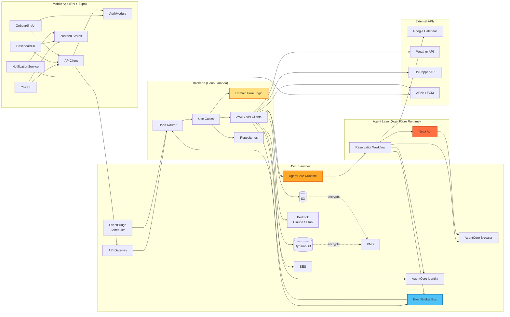

# Component Dependencies — わがママAI

**作成日**: 2026-05-08
**スコープ**: コンポーネント間依存関係、通信パターン、データフロー

---

## 1. 全体依存関係図



---

## 2. 依存マトリックス（誰が誰を呼ぶ）

### 2.1 Frontend 内部

| From → To | ChatUI | DashUI | OnbUI | Auth | APIC | Push | Store |
|---|:-:|:-:|:-:|:-:|:-:|:-:|:-:|
| ChatUI |  |  |  |  | ✓ | ✓ | ✓ |
| DashUI |  |  |  |  | ✓ |  | ✓ |
| OnbUI |  |  |  | ✓ | ✓ |  |  |
| AuthModule |  |  |  |  |  |  |  |
| APIClient |  |  |  | ✓ |  |  |  |
| Push |  |  |  |  |  |  | ✓ |

### 2.2 Backend 層間（Clean Architecture：内側のみ依存）

| From → To | Hono | Use Cases | Domain | Repo | Clients |
|---|:-:|:-:|:-:|:-:|:-:|
| Hono Router | (entry) | ✓ |  |  |  |
| Use Cases |  |  | ✓ | ✓ | ✓ |
| Domain |  |  | (pure) |  |  |
| Repositories |  |  | ✓ |  | (DDB SDK) |
| Clients |  |  |  |  | (AWS SDK) |

> **Clean Architecture 原則**: Domain は何にも依存しない（純ロジック）。Use Case は Domain と Infra のインタフェース（DI）に依存。Repository は Domain の Entity 型を返す（`Promise<ChatMessage[]>` 等）。

### 2.3 Agent Layer 内部

| From → To | Workflow | Nova Act | AgentCore Browser | AgentCore Identity | Calendar | EventBridge |
|---|:-:|:-:|:-:|:-:|:-:|:-:|
| ReservationWorkflow |  | ✓ | ✓ | ✓ | ✓ | ✓ |
| Nova Act |  |  | ✓ |  |  |  |

### 2.4 Cross-layer（Backend ↔ Agent ↔ Frontend）

```text
Frontend → API Gateway → Backend (Hono)
Backend → AgentCore Runtime（startAsync, 一方向キック）
AgentCore Runtime → EventBridge → Backend（完了通知ループバック）
Backend → APNs/FCM → Frontend（Push）
```

**重要**: Backend と Agent Layer は **直接の同期通信なし**。AgentCore Runtime API を介してのみ起動、完了は EventBridge 経由で疎結合。

---

## 3. 通信パターン

| パターン | 適用箇所 | プロトコル | 同期/非同期 |
|---|---|---|---|
| **REST API** | Mobile ↔ Backend (公開ルート) | HTTPS / JSON | 同期 |
| **InvokeAgentRuntime** | Backend → AgentCore | AWS API（async モード） | 非同期キック |
| **EventBridge → Lambda** | AgentCore 完了通知 / メトリクス更新 | EventBridge → Lambda invoke | 非同期 |
| **EventBridge Scheduler → Lambda** | F2 時刻ベース通知 | EventBridge Scheduler → Lambda invoke | 非同期 |
| **APNs / FCM Push** | Backend → Mobile | プッシュ通知 | Fire-and-forget |
| **CDP via AWS Backbone** | Nova Act → AgentCore Browser | WebSocket（CDP） | 同期 |
| **Bedrock InvokeModel** | Backend → Bedrock | AWS API | 同期（5 秒以内目標） |
| **DynamoDB** | Repositories → DynamoDB | AWS SDK | 同期 |
| **SES SendEmail** | Backend → SES | AWS SDK | 同期 |

---

## 4. データフロー（主要 4 シナリオ）

### 4.1 朝のアドバイス（F2）

```text
EventBridge Scheduler (06:30)
  → Hono Lambda (/internal/scheduled/morning-advice)
    → DataIntegrationService
      → Weather API (天気)
      → Google Calendar (予定、AgentCore Identity 経由)
    → Bedrock Claude (テキスト生成)
    → Bedrock Titan (画像生成)
    → S3 (画像保存) → presigned URL
    → DynamoDB ChatRepository (mama message 保存)
    → APNs / FCM (Push)
    → EventBridge Bus (MetricsUpdated イベント発行)
  → MetricsAggregationService (別ハンドラ呼出)
    → DynamoDB MetricsRepository (更新)
```

### 4.2 ユーザー発話 → ママ応答（F1）

```text
Mobile (POST /chat/messages)
  → API Gateway → Hono Lambda
    → ChatRepository.findRecent(10)
    → DynamoDB
    → Bedrock Claude (システムプロンプト + 履歴 + 新規メッセージ)
    → ChatRepository.save(user message, mama reply)
    → DynamoDB
    → EventBridge Bus (MetricsUpdated)
  → 200 OK with mamaReply
  → Mobile App (Zustand Store 更新、UI 描画)
```

### 4.3 代理予約（F3）— 核フロー（2026-05-08 改訂、レビュー指摘 1 対応）

```text
[Phase A: 受付（API Gateway 経由、~200ms で 202 返却）]
Mobile (POST /reservations) or EventBridge Scheduler (前夜 22:00)
  → API Gateway → Hono Lambda (public route)
    → ReservationStateRepository.create(sessionId, status="queued")
    → EventBridge Bus.publish("ReservationRequested")
    → return 202 Accepted
  ※ HotPepper も AgentCore も呼ばない → 29 秒タイムアウトに完全余裕

[Phase A.5: 実処理（EventBridge → 内部 worker Lambda、最大 15 分）]
EventBridge Bus
  → Hono Lambda (internal route /internal/events/reservation-requested)
    [Powertools Idempotency wrapped, key: sessionId]
    → ExternalDataService.searchRestaurants (HotPepper API)
    → ReservationStateRepository.updateStatus("in_progress")
    → AgentCoreRuntimeInvoker.invokeAndWait (同期、最大 8 分)
      → AgentCore Runtime 起動 (Phase B)

[Phase B: AgentCore Runtime 実行 (Python、Phase A.5 が同期で待機中)]
AgentCore Runtime
  → AgentCore Browser.browser_session() → CDP endpoint
  → Nova Act (CDP接続) → 食べログ操作
    → 内部で Nova Act AI 推論 (us-east-1) を呼出（透過的）
  → ReservationResult を返却
  → AgentCore Identity (Google OAuth トークン)
  → Google Calendar API (イベント追加)
  → 完了 → AgentCoreRuntimeInvoker に result 返却

Phase A.5 続き：
  → EventBridge Bus.publish("ReservationCompleted", {sessionId, result, eventId})

[Phase C: 完了処理（EventBridge → 内部 Lambda、Idempotency 保護）]
EventBridge Bus
  → Hono Lambda (/internal/events/reservation-completed)
    [Powertools Idempotency wrapped, key: eventId]
    → ReservationStateRepository.markCompleted(sessionId, result, eventId)
    → SES.sendReservationConfirmation
    → ChatRepository.save (mama message)
    → APNs / FCM (Push)
    → EventBridge Bus.publish("MetricsUpdated", {type: "zero_tap_action_completed"})
  → MetricsAggregationService → MetricsRepository (Counters + Snapshot)
```

### 4.4 ダッシュボード表示（F5）

```text
Mobile (GET /metrics?window=7d)
  → API Gateway → Hono Lambda
    → MetricsRepository.getLatest
    → MetricsRepository.getTrend (7日分)
    → DamenessMetrics.summarize (Domain pure)
    → "ヤバいランク" コメント生成
  → 200 OK { current, trend, comment }
  → Mobile (Zustand MetricsStore 更新、ゲージ描画)
```

---

## 5. 結合度（Coupling）と凝集度（Cohesion）

### 5.1 Loose Coupling 維持の工夫

- **Backend ↔ Agent Layer**: 直接呼出なし、AWS API（InvokeAgentRuntime）+ EventBridge のみ
- **Use Case ↔ Infrastructure**: インタフェース（`ChatRepository` 等）経由 DI、実装は差し替え可能
- **Domain ↔ External**: Domain は何にも依存せず、I/O は Application が橋渡し
- **メトリクス更新**: イベント駆動で同期処理から切り離し（Q4=B）

### 5.2 High Cohesion の工夫

- **Repository は責務単位で分離**: Chat / Profile / Metrics / Reservation
- **Use Case は 1 つの目的に集中**: SendMessage は応答生成のみ、メトリクス更新はイベントへ委譲
- **Service は 1 つの業務ワークフローに対応**: F3 全体は ReservationOrchestrationService に集約

---

## 6. 物理配置（マルチリージョン）

| Component | 配置リージョン | 備考 |
|---|---|---|
| Hono Lambda | ap-northeast-1 | API Gateway 経由 |
| AgentCore Runtime | ap-northeast-1 | Python ワークフロー |
| AgentCore Browser | ap-northeast-1 | フルマネージド |
| AgentCore Identity | ap-northeast-1 | OAuth トークン管理 |
| DynamoDB | ap-northeast-1 | 4 テーブル + 暗号化 (KMS) |
| S3 | ap-northeast-1 | 画像保存 |
| EventBridge Scheduler | ap-northeast-1 | F2 / F3 トリガー |
| EventBridge Bus | ap-northeast-1 | カスタムバス `wagamama-events` |
| SES | ap-northeast-1 | F3 確定メール |
| Bedrock (Claude/Titan) | ap-northeast-1 | テキスト・画像生成 |
| **Nova Act 推論** | **us-east-1** | **AWS 内部マネージド、CDK 管理対象外** |

リージョン跨ぎ通信は AgentCore Browser → Nova Act 推論のみ。AWS バックボーン経由 TLS。

---

## 7. データオーナーシップ

各 DynamoDB テーブルの所有 Repository：

| Table | Owner Repository | Domain Entity |
|---|---|---|
| `ChatMessages` | ChatRepository | ChatMessage |
| `UserProfiles` | UserProfileRepository | UserProfile |
| `MetricsCounters` | MetricsRepository | MetricsCounters（生カウンタ、source of truth） |
| `Metrics` | MetricsRepository | DamenessMetrics（Snapshot、計算結果キャッシュ） |
| `Reservations` | ReservationStateRepository | (Reservation Aggregate) |
| `IdempotencyStore` | Powertools Idempotency が直接管理（Repository は経由しない） | — |

> **原則**: テーブルへの書込は Owner Repository を通すのみ。横断クエリが必要なら専用の Read Model（後続 Construction で追加検討）。

---

## 8. 参照
- `aidlc-docs/inception/application-design/components.md`
- `aidlc-docs/inception/application-design/component-methods.md`
- `aidlc-docs/inception/application-design/services.md`
