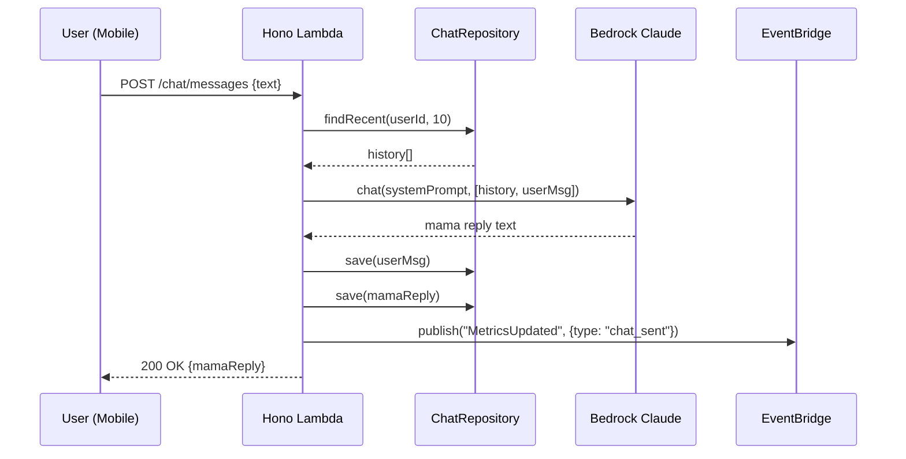
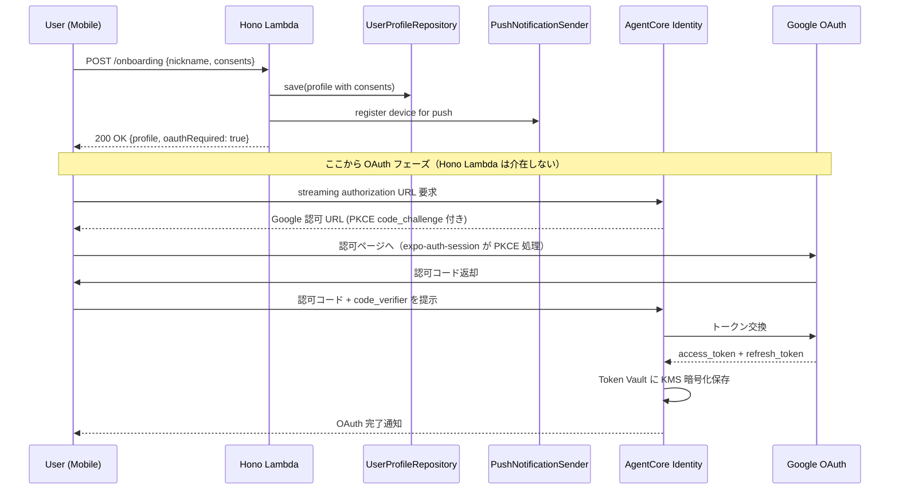
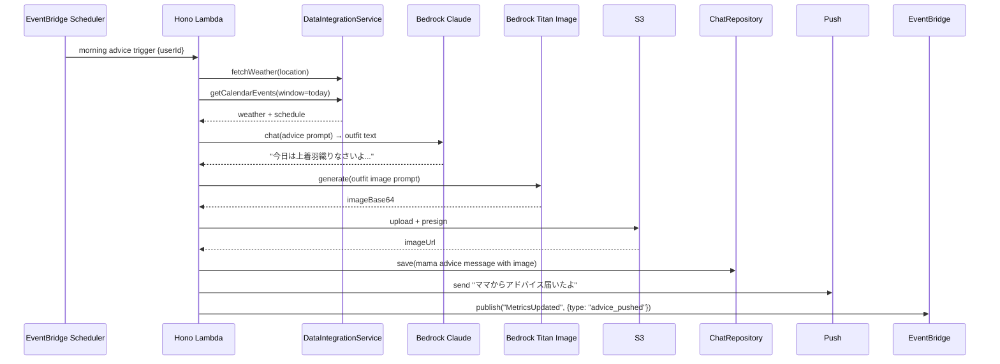
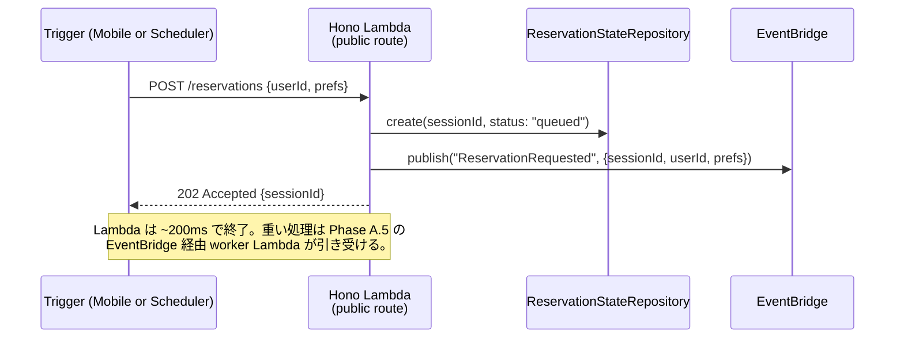
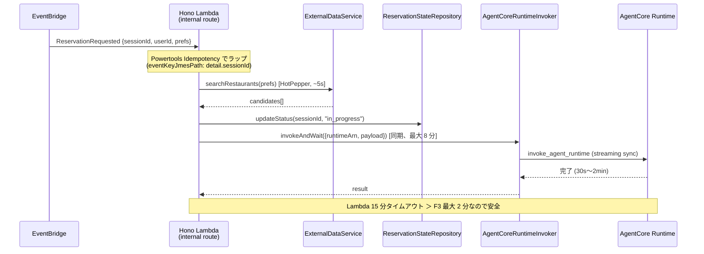
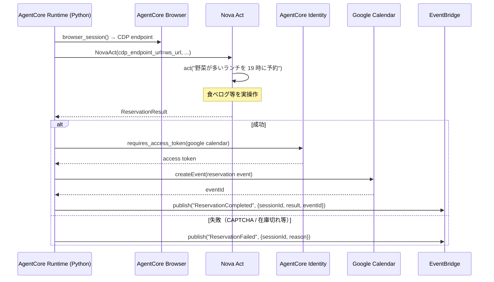
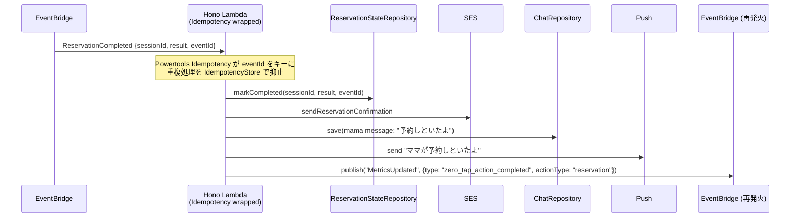
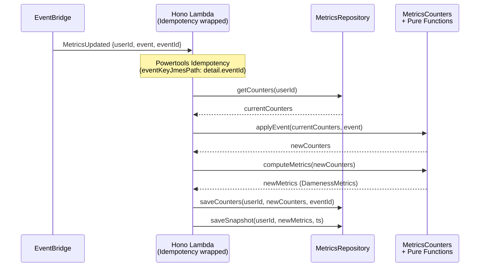

# Services & Orchestration — わがママAI

**作成日**: 2026-05-08
**スコープ**: サービスオーケストレーション、業務ワークフロー、サービス境界の定義
**前提**: Q3=B（AgentCore 非同期 + EventBridge）, Q4=B（メトリクス更新も EventBridge 経由）

---

## 1. サービスとは（本ドキュメントの定義）

ここでの「サービス」は、**複数の Use Case / Component を協調させて 1 つの業務ワークフローを成立させる単位**。

各サービスは：
- 入口（Trigger）が明確（HTTP / EventBridge / Scheduler / Push）
- 内部で複数の Use Case を呼び出す
- 1 つの**業務目的**に対応

> Application Layer の Use Case は「1 つの目的」のロジック。Service は「複数 Use Case を呼ぶマクロ的な orchestrator」。実装的には Hono Lambda の特定ルート + 内部呼び出しの全体。

---

## 2. サービス一覧

| Service | Trigger | 主目的 | 関連 Use Cases |
|---|---|---|---|
| **ChatService** | HTTPS POST `/chat/messages` | F1 ユーザー発話 → ママ応答 | SendChatMessageUseCase + UpdateMetricsUseCase（経由 EventBridge） |
| **OnboardingService** | HTTPS POST `/onboarding` | E1-S2 初回セットアップ | OnboardUserUseCase |
| **MorningAdviceService** | EventBridge Scheduler（毎日 6:30） | F2 朝の先回りアドバイス | GenerateMorningAdviceUseCase |
| **LunchAdviceService** | EventBridge Scheduler（毎日 11:30） | F2 昼前の食事アドバイス（ペルソナ別分岐） | GenerateLunchAdviceUseCase |
| **ReservationOrchestrationService** | EventBridge Scheduler / HTTPS POST `/reservations` | F3 代理予約全体 | TriggerReservationUseCase + HandleReservationCompletedUseCase |
| **MetricsAggregationService** | EventBridge `MetricsUpdated` イベント | F5 メトリクス計算と永続化 | UpdateMetricsUseCase |
| **DashboardService** | HTTPS GET `/metrics` | F5 ダッシュボード表示 | GetMetricsDashboardUseCase |
| **DataIntegrationService** | 他サービスから内部呼出（純粋ライブラリ的） | F6 外部 API 統合 | EnrichWithExternalDataUseCase |

---

## 3. サービス別ワークフロー

### 3.1 ChatService（F1）

**Trigger**: Mobile App → API Gateway → Hono Lambda `POST /chat/messages`



**ポイント**:
- Q4=B により、メトリクス更新は同期処理せず EventBridge にイベント発行のみ
- メトリクス計算は MetricsAggregationService が非同期で処理

---

### 3.2 OnboardingService（E1-S2、2026-05-08 改訂：レビュー指摘 3 対応）

**Trigger**: Mobile App → `POST /onboarding`（**OAuth code は同梱しない**、Hono Lambda は秘匿情報を一切扱わない）



**ポイント**：
- **Hono Lambda は OAuth code / token を一切見ない** → CloudWatch Logs 漏洩経路ゼロ
- Mobile 側は `expo-auth-session`（RFC 8252 / OAuth 2.1 準拠の PKCE）を使用、`client_secret` 不要
- AgentCore Identity が refresh token を Token Vault（KMS）に保存、F3 実行時は `@requires_access_token` デコレータで自動注入
- Google OAuth は `customParameters: {access_type: "offline"}` で refresh token を取得

---

### 3.3 MorningAdviceService（F2 / E2-S1, E2-S2）

**Trigger**: EventBridge Scheduler (cron: `30 6 * * *`) → Hono Lambda `POST /internal/scheduled/morning-advice`



---

### 3.4 LunchAdviceService（F2 / E2-S3, E2-S4）

**Trigger**: EventBridge Scheduler (cron: `30 11 * * *`)

E2-S3 と E2-S4 の分岐：

```typescript
// 内部ロジック（Service 内）
if (profile.subPersonaFlags.cookingSkill === "low") {
  // E2-S4 サブペルソナ向け：「コンビニで〇〇のサラダ買いな」
} else {
  // E2-S3 メイン向け：「ランチはサラダ多めにしなさい」
}
```

シーケンスは MorningAdviceService とほぼ同じだが、画像生成（Titan Image）はスキップ。

---

### 3.5 ReservationOrchestrationService（F3 / E3 全体）— 核（2026-05-08 改訂：レビュー指摘 1 対応）

**Trigger 1**: EventBridge Scheduler (cron: `0 22 * * *` 等、前夜トリガー)
**Trigger 2**: Mobile App → `POST /reservations`（手動依頼）

#### Phase A：受付（最小処理、〜200ms 想定 → 29 秒タイムアウトに完全に余裕）



**重要**：
- 公開 API ハンドラ（`POST /reservations`）は **DDB 書込 + EventBridge 発行のみ**。HotPepper API 呼出や AgentCore 起動は行わない
- **API Gateway 29 秒タイムアウトの心配は完全になくなる**（200ms で終わるため）
- 公式パターン：[Process events asynchronously with API Gateway and Lambda](https://docs.aws.amazon.com/prescriptive-guidance/latest/patterns/process-events-asynchronously-with-amazon-api-gateway-and-aws-lambda.html)

#### Phase A.5：実処理（EventBridge → 同 Lambda の内部ルート、最大 15 分）



**ポイント**：
- AWS SDK の `invoke_agent_runtime` は streaming sync API（fire-and-forget なし）。Lambda が同期で待つ必要があり、worker Lambda（API Gateway 経由しない）が 15 分の余裕で完遂する
- `invokeAndWait` の中身は `invoke_agent_runtime` を呼んでレスポンスストリームを最後まで読む。完了したら結果を返す

#### Phase B：AgentCore Runtime 実行（Phase A.5 の Lambda が同期で待つ間に裏で動く）



#### Phase C：完了処理（EventBridge → Hono Lambda の内部ルート、Idempotency 保護）



**E3-S2（失敗フォールバック）**は同様の流れで `ReservationFailed` イベントを処理（Idempotency 保護込み）。

**冪等性保証の二重化（レビュー指摘 2 対応）**：
1. **Powertools Idempotency**：handler 全体を `makeIdempotent` でラップ、IdempotencyStore テーブルに結果キャッシュ
2. **ReservationStateRepository.markCompleted**：内部で DDB 条件付き書込により eventId 重複を no-op 化

```typescript
// 実装イメージ
import { makeIdempotent, IdempotencyConfig } from '@aws-lambda-powertools/idempotency';
import { DynamoDBPersistenceLayer } from '@aws-lambda-powertools/idempotency/dynamodb';

const persistenceStore = new DynamoDBPersistenceLayer({ tableName: 'IdempotencyStore' });
const config = new IdempotencyConfig({ eventKeyJmesPath: 'detail.eventId' });

export const reservationCompletedHandler = makeIdempotent(
  async (event) => { /* SES + Push + DDB 更新 */ },
  { persistenceStore, config }
);
```

---

### 3.6 MetricsAggregationService（F5 / Q4=B、2026-05-08 改訂：レビュー指摘 4 対応）

**Trigger**: EventBridge カスタムバス `wagamama-events` の `MetricsUpdated` イベント



**ポイント**:
- メトリクス計算は **2 段の純関数**（PBT 対象）：
  - `applyEvent(counters, event) → newCounters`（単調増加性を保証）
  - `computeMetrics(counters) → DamenessMetrics`（[0, 100] 範囲、ゼロ除算耐性）
- Counters は source of truth（atomic ADD で永続化）、Snapshot は読取キャッシュ
- 冪等性は Powertools Idempotency + `saveCounters` の eventId による条件付き書込で二重保証

---

### 3.7 DashboardService（F5 / E4-S1）

**Trigger**: Mobile App → `GET /metrics?window=7d`

シンプルな読み取り：
- MetricsRepository から最新値とトレンドを取得
- `Get​MetricsDashboardUseCase` がママ口調コメントを生成（"ヤバいランク" 表示）

---

### 3.8 DataIntegrationService（F6）

他のサービスから内部関数として呼ばれる（独立した Lambda ではない、共通ライブラリ的）。

| メソッド | 対応 Story | 外部 API |
|---|---|---|
| `fetchWeather` | E5-S2 | 天気 API（無料公開） |
| `searchRestaurants` | E5-S3 | ホットペッパー API |
| `getCalendarEvents` | E5-S1 | Google Calendar API（OAuth 経由） |

---

## 4. サービス境界（責務マトリックス）

| Story | 関与するサービス |
|---|---|
| E1-S1 チャット会話 | ChatService |
| E1-S2 オンボーディング | OnboardingService |
| E1-S3 履歴永続化 | ChatService（含む） |
| E2-S1 朝コーデアドバイス | MorningAdviceService + DataIntegrationService |
| E2-S2 コーデ画像 | MorningAdviceService（内蔵） |
| E2-S3 昼食事アドバイス（メイン） | LunchAdviceService + DataIntegrationService |
| E2-S4 昼食事アドバイス（サブ） | LunchAdviceService（分岐） |
| E3-S1 予約成功 | ReservationOrchestrationService Phase A〜C |
| E3-S2 予約失敗 | ReservationOrchestrationService（失敗フロー） |
| E3-S3 Calendar 登録 | ReservationOrchestrationService Phase B |
| E3-S4 SES 通知 | ReservationOrchestrationService Phase C |
| E3-S5 Live View | AgentCore Browser 標準機能（実装不要） |
| E4-S1 ダッシュボード | DashboardService（読取） + MetricsAggregationService（書込） |
| E5-S1 OAuth 連携 | OnboardingService（初回） + AgentCore Identity（運用時） |
| E5-S2 天気取得 | DataIntegrationService（横断） |
| E5-S3 店検索 | DataIntegrationService（横断） |

---

## 5. オーケストレーション原則（2026-05-08 改訂）

1. **公開 API ハンドラは「受付係」に徹する**：HTTP 同期パスは DDB 書込 + EventBridge 発行のみ（〜200ms）。重い処理は EventBridge 経由の内部 worker Lambda へ委譲。**API Gateway 29 秒タイムアウトを越える処理は同期パスに置かない**（レビュー指摘 1 対応）
2. **イベント駆動で疎結合**：メトリクス更新・F3 完了処理は EventBridge 経由（Q4=B）。送信側も受信側も互いを直接知らない
3. **冪等性は二重防御**（レビュー指摘 2 対応）：
   - **Layer 1**：すべての非同期ハンドラを `@aws-lambda-powertools/idempotency` の `makeIdempotent` でラップ。`IdempotencyStore` DynamoDB テーブルに結果キャッシュ（PK: `id`、TTL: `expiration`）
   - **Layer 2**：Repository 層で `eventId` 引数を必須化、DDB 条件付き書込で重複を no-op 化
4. **OAuth 認証情報は Lambda で扱わない**（レビュー指摘 3 対応）：Mobile App ↔ AgentCore Identity ↔ Token Vault の直結フロー。Hono Lambda は `googleAuthCode` も `access_token` も見ない（CloudWatch Logs 漏洩経路ゼロ）
5. **メトリクス計算は 2 段純関数**（レビュー指摘 4 対応）：`applyEvent` → `computeMetrics` の合成。Counters（source of truth）と Snapshot（キャッシュ）を分離
6. **Use Case と Service の区別**（レビュー指摘 5 対応）：1 クラス = 1 execute メソッドが Use Case、複数メソッドの横断統合は `application/services/` の Service として配置
7. **責務分離**：Bedrock 呼出は Lambda、ブラウザ操作は AgentCore Runtime、SES は Lambda（IAM 権限集約）
8. **Failure handling**：EventBridge DLQ + CloudWatch アラームで不達検知（Construction Phase で詳細設計）

### 5.1 非同期ハンドラ一覧（Powertools Idempotency 必須）

| Handler | Trigger | Idempotency Key |
|---|---|---|
| `ProcessReservationRequestUseCase` | EventBridge `ReservationRequested` | `detail.sessionId` |
| `HandleReservationCompletedUseCase` | EventBridge `ReservationCompleted` | `detail.eventId` |
| `HandleReservationFailedUseCase` | EventBridge `ReservationFailed` | `detail.eventId` |
| `UpdateMetricsUseCase` | EventBridge `MetricsUpdated` | `detail.eventId` |
| `morningAdviceHandler` | EventBridge Scheduler | `<userId>#<date>` |
| `lunchAdviceHandler` | EventBridge Scheduler | `<userId>#<date>` |

---

## 6. 参照
- `aidlc-docs/inception/application-design/components.md`
- `aidlc-docs/inception/application-design/component-methods.md`
- `aidlc-docs/inception/application-design/component-dependency.md`
- `aidlc-docs/inception/user-stories/stories.md`
