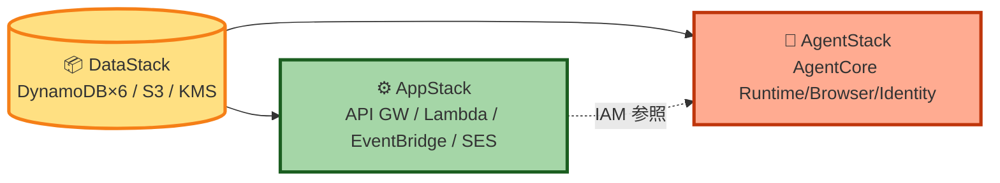
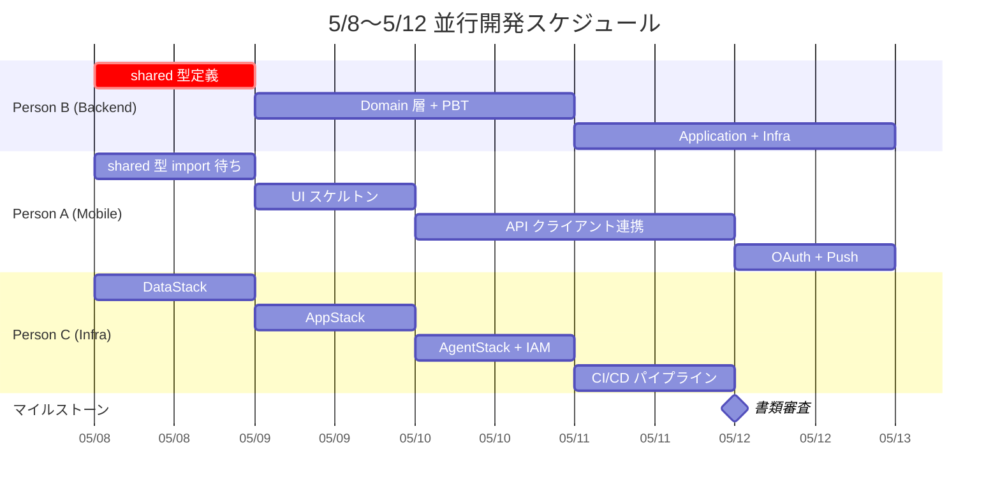

# Unit of Work — Dependency Matrix

**作成日**: 2026-05-08
**前提**: unit-of-work.md（4 Unit + shared）

---

## 1. 依存マトリックス（誰が誰に依存するか）

| From → To | U1 Mobile | U2 Backend | U3 Agent Runtime | U4 Infra (CDK) | shared |
|---|:-:|:-:|:-:|:-:|:-:|
| **U1 Mobile** | — | 🌐 REST + Push | — | — | 📦 build-time |
| **U2 Backend** | — | — | ⚙️ AgentCore API | — | 📦 build-time |
| **U3 Agent Runtime** | — | 🔔 EventBridge | — | — | — |
| **U4 Infra (CDK)** | 📦 build-asset | 📦 build-asset | 📦 docker-asset | — | — |
| **shared** | — | — | — | — | — |

**凡例**：
- 🌐 **REST + Push**：HTTPS 同期 / 非同期通知
- ⚙️ **AgentCore API**：`InvokeAgentRuntime`（streaming sync）
- 🔔 **EventBridge**：非同期イベント発行
- 📦 **build-time**：型のみインポート（実行時コードなし）
- 📦 **build-asset**：CDK が成果物を packaging（Lambda 用 zip / mobile EAS は対象外）
- 📦 **docker-asset**：CDK DockerImageAsset で Docker build → ECR push → AgentCore Runtime 配信

> **重要**: U1 ↔ U3, U3 ↔ U1 の直接依存はゼロ。すべて U2 を経由 or イベント駆動。

---

## 2. CDK スタック間依存（Q4=B 複数スタック）



**デプロイ順序**：`cdk deploy DataStack AppStack AgentStack` または `cdk deploy --all`（CDK が自動で依存解決）。

**Cross-Stack Reference**：
- `DataStack` → `AppStack`：DynamoDB Table ARN、S3 Bucket ARN、KMS Key ARN を CfnOutput で公開
- `DataStack` → `AgentStack`：`MetricsCounters` テーブル ARN、`Reservations` テーブル ARN
- `AppStack` → `AgentStack`：EventBridge Bus ARN（AgentCore Runtime が `ReservationCompleted` 発行先として使用）

---

## 3. ランタイム通信契約

### 3.1 U1 Mobile ↔ U2 Backend（REST API）

公開 API 5 ルート + 非同期 Push 通知：

| Endpoint | Method | Request DTO | Response DTO |
|---|---|---|---|
| `/chat/messages` | POST | `SendChatMessageRequest` | `SendChatMessageResponse` |
| `/chat/messages` | GET | `GetChatHistoryQuery` | `GetChatHistoryResponse` |
| `/onboarding` | POST | `OnboardingRequest` | `OnboardingResponse` |
| `/reservations` | POST | `TriggerReservationRequest` | `TriggerReservationResponse` (202) |
| `/metrics` | GET | `GetMetricsQuery` | `GetMetricsResponse` |

**型定義の所在**：`packages/shared/src/api/`（U1 と U2 が同じ型を import）。

**Push 通知ペイロード**：

```typescript
// shared/src/api/push.ts
type PushPayload =
  | { type: "advice_pushed"; advice: AdvicePreview }
  | { type: "reservation_completed"; sessionId: string; result: ReservationSummary }
  | { type: "reservation_failed"; sessionId: string; reason: FailureReason };
```

### 3.2 U2 Backend → U3 Agent Runtime（AgentCore API）

```text
方向：U2 → U3 のみ（同期 streaming sync 呼出）
API：InvokeAgentRuntime
ペイロード：JSON in / JSON out
注意：streaming sync のため U2 側が待つ（最大 8 分想定、Lambda 15 分以内）
```

**ペイロード型**：

```python
# packages/agent/src/lib/types.py
@dataclass
class ReservationPayload:
    sessionId: str
    userId: str
    candidates: list[Candidate]
    preference: PreferenceProfile
    timeSlot: TimeSlot

@dataclass
class ReservationResult:
    sessionId: str
    status: Literal["completed", "failed"]
    storeName: Optional[str]
    confirmationNumber: Optional[str]
    failureReason: Optional[str]
```

> **設計上の注意**：U3 は Python なので `shared` パッケージ（TypeScript）を直接使えない。型は手動で同期する（または OpenAPI / JSON Schema 自動生成を将来検討）。

### 3.3 U3 Agent Runtime → U2 Backend（EventBridge）

```text
方向：U3 → EventBridge → U2 の内部ルート（非同期）
イベント：ReservationCompleted / ReservationFailed
保証：at-least-once（U2 側で Powertools Idempotency 保護）
```

**イベントスキーマ**（U2 側、`packages/shared/src/events/`）：

```typescript
type ReservationCompletedEvent = {
  source: "wagamama.agent";
  detailType: "ReservationCompleted";
  detail: {
    eventId: string;          // 冪等性キー（UUID）
    sessionId: string;
    userId: string;
    result: ReservationResult;
    completedAt: string;      // ISO8601
  };
};

type ReservationFailedEvent = {
  source: "wagamama.agent";
  detailType: "ReservationFailed";
  detail: {
    eventId: string;
    sessionId: string;
    userId: string;
    reason: "captcha_required" | "out_of_stock" | "auth_failure" | "unknown";
    detail?: string;
    failedAt: string;
  };
};
```

### 3.4 U2 内部の EventBridge ループバック

| イベント | 発行元 | 受信元 | Idempotency Key |
|---|---|---|---|
| `ReservationRequested` | `POST /reservations` ハンドラ | `process-reservation-request` 内部ハンドラ | `detail.sessionId` |
| `MetricsUpdated` | 各 Use Case 完了時 | `metrics-update` 内部ハンドラ | `detail.eventId` |
| Schedule 起動 | EventBridge Scheduler (cron) | `morning-advice` / `lunch-advice` 内部ハンドラ | `<userId>#<date>` |

---

## 4. ビルド時依存（package.json）

```text
@wagamama/mobile/package.json:
  "dependencies": {
    "@wagamama/shared": "workspace:*"
  }

@wagamama/backend/package.json:
  "dependencies": {
    "@wagamama/shared": "workspace:*"
  }

@wagamama/infra/package.json:
  "dependencies": {
    "@wagamama/shared": "workspace:*"  // EventBridge イベント型を IaC で参照
  },
  "devDependencies": {
    // Lambda コード asset として backend ビルド成果物を参照
  }

@wagamama/agent/pyproject.toml:
  // Python 単独。shared を import しない（手動同期）
```

---

## 5. 並行開発のクリティカルパス（Q6=C 3 人並行）



**クリティカルパス**：Person B の **shared 型定義（5/8 中）→ Person A/C の作業着手**。これが遅れると並行開発が破綻するため最優先。

---

## 6. 参照
- `aidlc-docs/inception/application-design/unit-of-work.md`（Unit 詳細）
- `aidlc-docs/inception/application-design/unit-of-work-story-map.md`（Story 割当）
- `aidlc-docs/inception/application-design/services.md`（イベントフロー詳細）
- `aidlc-docs/inception/application-design/component-dependency.md`（Component 単位の依存）
