# Execution Plan — わがママAI

**作成日**: 2026-05-08
**プロジェクトタイプ**: Greenfield
**前提**: requirements.md（5 機能 MVP, AgentCore + Nova Act 構成）, stories.md（16 ストーリー / 5 エピック）, personas.md（メイン 2 + サブ 1）

---

## 1. Detailed Analysis Summary

### 1.1 Transformation Scope
- **Greenfield 新規開発**のため Brownfield 用の Transformation Scope 分析は **N/A**
- Reverse Engineering 工程はスキップ済み

### 1.2 Change Impact Assessment

| 観点 | 影響有無 | 内容 |
|---|---|---|
| **User-facing changes** | ✅ Yes | チャット UI、ダッシュボード、オンボーディング、通知すべて新規 |
| **Structural changes** | ✅ Yes | システム全体を新規構築（Mobile App + Backend + Agent Layer + Multi-region） |
| **Data model changes** | ✅ Yes | DynamoDB テーブル群を新設（チャット履歴・ユーザープロファイル・メトリクス・予約状態） |
| **API changes** | ✅ Yes | Hono REST API 群、AgentCore Runtime InvokeAgentRuntimeCommand 連携 |
| **NFR impact** | ✅ Yes | パフォーマンス（5 秒以内）、Security Baseline（PII / KMS / OAuth）、マルチリージョン低レイテンシ、PBT |

### 1.3 Component Relationships（Greenfield 計画図）

```text
[Mobile App (RN + Expo)]
       │ HTTPS
       ▼
[API Gateway] → [Hono Lambda (TypeScript)]
       │            │
       │            ├─ Bedrock Claude (チャット応答 / アドバイス生成)
       │            ├─ Bedrock Titan Image (コーデ画像)
       │            ├─ DynamoDB (チャット / プロファイル / メトリクス)
       │            ├─ S3 (画像)
       │            ├─ EventBridge Scheduler (朝の能動通知)
       │            ├─ SES (確定メール)
       │            └─ AgentCore Runtime ← InvokeAgentRuntimeCommand
       │                    │
       │                    ▼
       │            [AgentCore Runtime (Python / Nova Act ワークフロー)]
       │                    │
       │                    ├─ AgentCore Browser (CDP endpoint 払い出し)
       │                    │       │
       │                    │       ▼
       │                    │   Nova Act SDK (ブラウザ操作)
       │                    │       │
       │                    │       ▼
       │                    │   Nova Act AI 推論 (us-east-1)
       │                    │
       │                    ├─ AgentCore Identity (Google OAuth トークン注入)
       │                    └─ Google Calendar API
       │
       └─ 外部 API (天気 API, ホットペッパー API)
```

### 1.4 Risk Assessment

| 評価軸 | レベル | 根拠 |
|---|---|---|
| **Risk Level** | **Medium-High** | 新技術（AgentCore 2026 GA / Nova Act 2025 GA）、マルチリージョン、ハッカソン期限の同時要素 |
| **Rollback Complexity** | **Easy** | Greenfield のため再デプロイで対応可、データ消失リスクは MVP 期間限定 |
| **Testing Complexity** | **Complex** | LLM 出力非決定性、ブラウザ自動化（CAPTCHA / 在庫変動）、マルチリージョン Latency |

### 1.5 ハッカソン制約とのアライメント

| マイルストーン | 期日 | 必要成果物 |
|---|---|---|
| **書類審査** | 2026-05-12 12:00 | GitHub リポ（README / requirements / stories / personas / **application-design / units**） |
| **予選デモ** | 2026-05-30 | 動作 MVP（Code Generation / Build & Test 完了） |
| **決勝デモ** | 2026-06-26 | AWS デプロイ済デモ（Operations 相当が必要） |

---

## 2. Workflow Visualization

```mermaid
flowchart TD
    Start(["わがママAI 構築"])

    subgraph INCEPTION["🔵 INCEPTION PHASE"]
        WD["Workspace Detection<br/><b>COMPLETED</b>"]
        RA["Requirements Analysis<br/><b>COMPLETED</b>"]
        US["User Stories<br/><b>COMPLETED</b>"]
        WP["Workflow Planning<br/><b>IN PROGRESS</b>"]
        AD["Application Design<br/><b>EXECUTE</b>"]
        UG["Units Generation<br/><b>EXECUTE</b>"]
    end

    subgraph CONSTRUCTION["🟢 CONSTRUCTION PHASE"]
        FD["Functional Design<br/>(per-unit)<br/><b>EXECUTE</b>"]
        NFRA["NFR Requirements<br/>(per-unit)<br/><b>EXECUTE</b>"]
        NFRD["NFR Design<br/>(per-unit)<br/><b>EXECUTE</b>"]
        ID["Infrastructure Design<br/>(per-unit)<br/><b>EXECUTE</b>"]
        CG["Code Generation<br/>(per-unit)<br/><b>EXECUTE</b>"]
        BT["Build and Test<br/><b>EXECUTE</b>"]
    end

    subgraph OPERATIONS["🟡 OPERATIONS PHASE"]
        OPS["Operations<br/><b>PLACEHOLDER</b>"]
    end

    Start --> WD
    WD --> RA
    RA --> US
    US --> WP
    WP --> AD
    AD --> UG
    UG --> FD
    FD --> NFRA
    NFRA --> NFRD
    NFRD --> ID
    ID --> CG
    CG -.->|Next Unit| FD
    CG --> BT
    BT -.-> OPS
    BT --> End(["MVP 完成"])

    style WD fill:#4CAF50,stroke:#1B5E20,stroke-width:3px,color:#fff
    style RA fill:#4CAF50,stroke:#1B5E20,stroke-width:3px,color:#fff
    style US fill:#4CAF50,stroke:#1B5E20,stroke-width:3px,color:#fff
    style WP fill:#4CAF50,stroke:#1B5E20,stroke-width:3px,color:#fff
    style AD fill:#FFA726,stroke:#E65100,stroke-width:3px,stroke-dasharray: 5 5,color:#000
    style UG fill:#FFA726,stroke:#E65100,stroke-width:3px,stroke-dasharray: 5 5,color:#000
    style FD fill:#FFA726,stroke:#E65100,stroke-width:3px,stroke-dasharray: 5 5,color:#000
    style NFRA fill:#FFA726,stroke:#E65100,stroke-width:3px,stroke-dasharray: 5 5,color:#000
    style NFRD fill:#FFA726,stroke:#E65100,stroke-width:3px,stroke-dasharray: 5 5,color:#000
    style ID fill:#FFA726,stroke:#E65100,stroke-width:3px,stroke-dasharray: 5 5,color:#000
    style CG fill:#4CAF50,stroke:#1B5E20,stroke-width:3px,color:#fff
    style BT fill:#4CAF50,stroke:#1B5E20,stroke-width:3px,color:#fff
    style OPS fill:#FFF59D,stroke:#F57F17,stroke-width:2px,stroke-dasharray: 5 5,color:#000
    style INCEPTION fill:#BBDEFB,stroke:#1565C0,stroke-width:3px,color:#000
    style CONSTRUCTION fill:#C8E6C9,stroke:#2E7D32,stroke-width:3px,color:#000
    style OPERATIONS fill:#FFF59D,stroke:#F57F17,stroke-width:3px,color:#000
    style Start fill:#CE93D8,stroke:#6A1B9A,stroke-width:3px,color:#000
    style End fill:#CE93D8,stroke:#6A1B9A,stroke-width:3px,color:#000

    linkStyle default stroke:#333,stroke-width:2px
```



---

## 3. Phases to Execute

### 🔵 INCEPTION PHASE

- [x] **Workspace Detection** — COMPLETED（Greenfield 確認、aidlc-state.md 生成済）
- [x] **Reverse Engineering** — SKIPPED（Greenfield 適用外）
- [x] **Requirements Analysis** — COMPLETED（2026-05-07 ハッカソン版改訂、2026-05-08 F4 カット）
- [x] **User Stories** — COMPLETED（2026-05-08、16 ストーリー / 3 ペルソナ生成）
- [x] **Workflow Planning** — IN PROGRESS（本ドキュメント）
- [ ] **Application Design** — **EXECUTE**
  - **Rationale**: 新規コンポーネント（Frontend / API / Agent Runtime / Data Integration）多数。サービス層・コンポーネント間境界・依存関係を明文化しないと Units Generation の精度が落ちる。**5/12 書類審査までに必須**。
- [ ] **Units Generation** — **EXECUTE**
  - **Rationale**: AgentCore Runtime（Python）と Hono API（TypeScript）が異なる実行環境・言語。Mobile App / Hono API / Agent Runtime / 基盤データ層を独立 Unit として分解しないと並行開発と段階デプロイが破綻。**5/12 書類審査までに必須**。

### 🟢 CONSTRUCTION PHASE（per-unit ループ）

- [ ] **Functional Design** (per-unit) — **EXECUTE**
  - **Rationale**: ママ口調生成プロンプト、ダメ度メトリクス計算式（§2.3）、Nova Act ワークフロー、F3 フォールバック制御など複雑なビジネスロジックが多数。Unit ごとに詳細設計が必要。
- [ ] **NFR Requirements** (per-unit) — **EXECUTE**
  - **Rationale**: Bedrock 応答 5 秒以内、画像生成 30 秒以内、PII 暗号化 (KMS)、OAuth 集中管理、Nova Act の us-east-1 跨ぎレイテンシ等、Unit ごとに NFR 性質が異なる。Security Baseline Extension 適用済のため必須。
- [ ] **NFR Design** (per-unit) — **EXECUTE**
  - **Rationale**: NFR Requirements に対するパターン適用（KMS 設計、OAuth トークンリフレッシュ、リトライ戦略、サーキットブレーカー等）を Unit ごとに具体化。
- [ ] **Infrastructure Design** (per-unit) — **EXECUTE**
  - **Rationale**: マルチリージョン構成（ap-northeast-1 / us-east-1）、AgentCore Runtime / Browser / Identity の IaC、CDK スタック設計、API Gateway / Lambda / DynamoDB / S3 / EventBridge / SES 構成定義。
- [ ] **Code Generation** (per-unit) — **EXECUTE (ALWAYS)**
  - **Rationale**: 実装コード生成必須。Hono Lambda、Nova Act ワークフロー、CDK、React Native フロント。
- [ ] **Build and Test** — **EXECUTE (ALWAYS)**
  - **Rationale**: ビルド・ユニットテスト・統合テスト・PBT（純ロジック層）必須。Property-Based Testing Extension 適用済。

### 🟡 OPERATIONS PHASE

- [ ] **Operations** — **PLACEHOLDER**
  - **Rationale**: 現バージョンではプレースホルダ。**ただし 6/26 決勝までに「AWS デプロイ済デモ」が必須**のため、本工程相当のデプロイ作業は Build and Test 後に手動 or CDK Deploy で実施する想定（フレームワーク化は将来）。

---

## 4. Skipped Stages

| Stage | 理由 |
|---|---|
| **Reverse Engineering** | Greenfield のため適用外 |

実質、ハッカソン開発に必要な全ステージを実行する。

---

## 5. Estimated Timeline

ハッカソンマイルストーンに合わせた逆算スケジュール：

| 期間 | Stage | 主要成果物 |
|---|---|---|
| **2026-05-08〜09** | Application Design | components.md / services.md / component-methods.md |
| **2026-05-10〜11** | Units Generation | unit-of-work.md / unit-dependency.md / story map |
| **2026-05-12 12:00** | **書類審査締切** | GitHub リポ提出（INCEPTION 全成果物） |
| **2026-05-13〜18** | Per-unit Functional Design + NFR Req/Design + Infra Design | 各 Unit の design 群 |
| **2026-05-19〜29** | Per-unit Code Generation + Build and Test | 動作 MVP |
| **2026-05-30** | **予選デモ@麻布台ヒルズ** | 動作 MVP デモ |
| **2026-05-31〜06-25** | フェーズ2 統合（AgentCore Memory / Gateway / Policy / Observability / Code Interpreter）+ 強化開発 + AWS デプロイ | 決勝向け強化版 |
| **2026-06-26** | **決勝デモ@AWS Summit Japan 2026** | AWS デプロイ済デモ |

> **Note**: 5/8〜5/12 で 4.5 日と短いが、ペアプロ風に AI-DLC + Claude Code を回せば達成可能。タスクが膨らんだら Application Design と Units Generation を並列・短縮可能。

---

## 6. Success Criteria

### Primary Goal
**ハッカソン書類審査（5/12）を確実に通過し、5/30 予選デモで動作 MVP を提示、6/26 決勝で AWS 上で動くデモを成功させる**

### Key Deliverables（Stage 別）

| Stage | Deliverable |
|---|---|
| Application Design | `aidlc-docs/inception/application-design/components.md` 等 |
| Units Generation | `aidlc-docs/inception/application-design/unit-of-work.md` 等 |
| Construction (per-unit) | 各 Unit の functional / nfr / infrastructure 設計 + 実装コード |
| Build and Test | 全 Unit ビルド成功 + テスト合格（PBT 含む） |

### Quality Gates

- [ ] requirements.md と stories.md の全機能要件が application-design / unit-of-work に追跡可能
- [ ] **Security Baseline Extension** — 全該当ステージで Compliant（PII 暗号化・OAuth・最小権限）
- [ ] **Property-Based Testing Extension** — 純ロジック層は PBT カバー、LLM/外部 I/O は example-based
- [ ] 5 設計選択 (1)〜(5) の実装トレース可能（コード上の対応箇所）
- [ ] AgentCore + Nova Act 連携が AWS 公式パターン通り実装されている
- [ ] マルチリージョン（ap-northeast-1 自前 / us-east-1 Nova Act 推論）が CDK と整合

---

## 7. 参照

- `aidlc-docs/inception/requirements/requirements.md`
- `aidlc-docs/inception/user-stories/stories.md`
- `aidlc-docs/inception/user-stories/personas.md`
- `aidlc-docs/aidlc-state.md`
- `.aidlc-rule-details/inception/workflow-planning.md`
- `.aidlc-rule-details/extensions/security/baseline/security-baseline.md`（Enabled）
- `.aidlc-rule-details/extensions/testing/property-based/property-based-testing.md`（Enabled）
